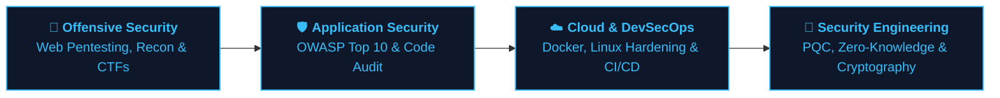

# Hi, I'm Usman Fazal 👋

  <b>Cybersecurity Graduate</b> building practical security tools, secure applications, and privacy-focused systems.

  <i>"Learn. Break. Build. Secure."</i>

<!-- Clean, refined contact badges -->

---

### 🧑‍💻 About Me

I am a **BS Cybersecurity graduate** passionate about understanding how systems operate, discovering where they break, and engineering robust solutions to defend them.

My hands-on work bridges **offensive security, application security, reverse engineering, and cryptographic engineering**:

* 🎓 **BS in Cybersecurity** with solid foundations in application security, network defense, and cryptography.
* 🛡️ **Offensive & Web Security:** Experienced with **OWASP Top 10**, asset enumeration, auth flaws, and manual vulnerability verification.
* 🔬 **Cryptographic Tool Builder:** Designed and implemented **NGCloud** as my Final Year Project, pairing NIST post-quantum key encapsulation with client-side zero-knowledge architecture.
* 🔎 **Reverse Engineering:** Experienced decompiling Android APKs (**JADX**, **APKTool**), reconstructing proprietary protocols, and identifying undocumented API endpoints.
* 🐧 **System Proficiency:** Daily Linux & Kali Linux workflow, Docker container isolation, and Python/Bash automation.
* 🧪 **Hands-On Labs:** Regular practical work across **Hack The Box**, **TryHackMe**, and vulnerable web labs (DVWA, OWASP Juice Shop).

---

### 🛡️ Security Focus & Core Areas

<table>
  <tr>
    <td width="50%" valign="top">
      <h4>🎯 Offensive & Web Security</h4>
      <ul>
        <li><b>Web Penetration Testing:</b> Methodical enumeration, parameter fuzzing, and manual exploit verification.</li>
        <li><b>OWASP Top 10 Mitigation:</b> Identifying and mitigating XSS, SQLi, IDOR, SSRF, and CSRF vulnerabilities.</li>
        <li><b>Auth & Session Flaws:</b> JWT signature bypasses, token expiration risks, and broken access controls.</li>
        <li><b>Security Tooling:</b> Custom multithreaded port scanners and automated reconnaissance scripts.</li>
      </ul>
    </td>
    <td width="50%" valign="top">
      <h4>🔒 Cryptography & Privacy</h4>
      <ul>
        <li><b>Post-Quantum Cryptography:</b> NIST FIPS 203 <b>ML-KEM-768</b> key encapsulation mechanism.</li>
        <li><b>Client-Side Zero-Knowledge:</b> Memory-only browser cryptographic boundaries with zero server-side trust.</li>
        <li><b>Lightweight AEAD & Ciphers:</b> <b>Ascon-128a</b> authenticated encryption and custom lattice stream ciphers.</li>
        <li><b>Key Derivation & Hashing:</b> <b>Argon2id</b> memory-hard KDF and quantum-walk simulated hash (KT-QHF).</li>
      </ul>
    </td>
  </tr>
  <tr>
    <td width="50%" valign="top">
      <h4>🔎 Reverse Engineering & Analysis</h4>
      <ul>
        <li><b>Android APK Decompilation:</b> Static bytecode inspection using <b>JADX-GUI</b> and <b>APKTool</b>.</li>
        <li><b>Protocol & API Extraction:</b> Intercepting socket payloads, extracting hidden REST endpoints, and analyzing data flow.</li>
        <li><b>Binary Fundamentals:</b> Inspecting ELF/PE structures, string extraction, and Ghidra disassembly.</li>
        <li><b>Software Reconstruction:</b> Re-engineering functional software clients from reverse-engineered specifications.</li>
      </ul>
    </td>
    <td width="50%" valign="top">
      <h4>☁️ Cloud & Infrastructure Security</h4>
      <ul>
        <li><b>Linux Server Hardening:</b> Service auditing, SSH key policy enforcement, and permission least-privilege.</li>
        <li><b>Container Isolation:</b> Docker Compose and multi-container security configurations.</li>
        <li><b>Object Storage Security:</b> MinIO S3 bucket access policies, presigned URLs, and CORS hardening.</li>
        <li><b>Relational DB Integrity:</b> PostgreSQL schema constraints, RBAC, and hash-chained audit trails.</li>
      </ul>
    </td>
  </tr>
</table>

---

### 🚀 Featured Practical Projects

#### 1. 🛡️ [NG-CLOUD — Post-Quantum Zero-Knowledge Cloud Storage](https://github.com/Usman-Cys/NG-CLOUD)
> **Final Year Project (BS Cybersecurity)**

A client-side zero-knowledge cloud storage platform engineered to protect files against "Harvest Now, Decrypt Later" quantum threats. Plaintext files, passwords, and private decryption keys exist exclusively in volatile browser RAM and never reach the backend server or database.

* **Cryptography & WebAssembly:** Pure Rust compiled to WebAssembly running **NIST FIPS 203 ML-KEM-768**, custom **FS-MLWE-SC-256** lattice stream cipher with 1 MB epoch rekeying, **Ascon-128a AEAD**, **Argon2id**, and **KT-QHF** hash.
* **Storage & Architecture:** Direct presigned S3 transfers to **MinIO Object Storage**, metadata handling via **PostgreSQL 15**, and **Express 5 / Node.js** API gateway.
* **Collaboration & Sync:** Cryptographic key re-wrapping under recipient public keys, 4 MB chunk-level delta synchronization, and 15-minute concurrency lock leases.
* **Tech Stack:** `Rust` • `WebAssembly` • `React 18` • `Vite` • `Node.js` • `Express` • `PostgreSQL` • `MinIO S3` • `Docker`

---

#### 2. 🔍 [Android APK Reverse Engineering & Protocol Extraction](https://github.com/Usman-Cys/partybox-photobooth-final)
> **Binary & Protocol Reverse Engineering Project**

In-depth static and dynamic reverse engineering of proprietary Android APKs ([Kodak](https://github.com/Usman-Cys/kodak-reverse-eng) & [PartyBox](https://github.com/Usman-Cys/partybox-photobooth-final)).

* Analyzed compiled classes using **JADX-GUI** and **APKTool** to navigate obfuscated bytecode, trace state machines, and map internal logic execution paths.
* Intercepted socket traffic to extract hidden TCP commands, hardware communication ports, and internal REST API endpoints.
* Used the reversed protocol specifications to re-author a clean, modern working software interface from scratch.
* **Tech Stack:** `JADX` • `APKTool` • `Android Bytecode` • `Wireshark` • `Socket Analysis`

---

#### 3. ⚡ [VulnIntel — Vulnerability Assessment & Security Analysis Platform](https://github.com/Usman-Cys/VulnIntel)
> **Application Security & Automated Triage**

An intelligent security analysis engine uniting **DAST** and **SAST** security assessment pipelines with Google Gemini AI contextual analysis for automated attack surface mapping, CVSS 3.1 scoring, and prioritized remediation playbooks.

* **Tech Stack:** `Python` • `FastAPI` • `DAST/SAST` • `Gemini AI` • `React` • `Tailwind CSS`

---

#### 4. 🧰 Network Reconnaissance & Security Tooling

* **[Port-Scanner](https://github.com/Usman-Cys/Port-scanner):** Custom multithreaded network utility for rapid TCP and UDP port discovery, socket state verification, and open service identification.
* **[Password-Analyzer](https://github.com/Usman-Cys/password-analyzer):** Security evaluation tool calculating Shannon entropy, testing dictionary vulnerability, and verifying cryptographic salt/hash resistance.
* **[Sentinel](https://github.com/Usman-Cys/Sentinel):** Web penetration testing assistant automating initial reconnaissance, endpoint enumeration, and parameter discovery.

---

### 🧪 Hands-On Labs & Practical Training

I actively strengthen my offensive security skills through hands-on labs and challenge environments:

| Platform / Lab | Focus Areas & Hands-On Skills | Primary Tools Used |
| :--- | :--- | :--- |
| **Hack The Box** | Linux Privilege Escalation, SSH Enumeration, Web Exploitation, CTF challenges | `Nmap`, `Burp Suite`, `LinPEAS`, `Netcat` |
| **TryHackMe** | Web Security Fundamentals, Network Security, Active Directory Basics, Linux Hardening | `Gobuster`, `Hydra`, `Metasploit`, `John` |
| **Vulnerable Apps** | Manual OWASP testing on DVWA, OWASP Juice Shop, and custom vulnerable microservices | `Burp Suite Pro`, `OWASP ZAP`, `SQLmap` |
| **Traffic Inspection** | Dissecting packet captures (.pcap), spotting cleartext credential leaks, DNS analysis | `Wireshark`, `Tcpdump`, `Tshark` |

---

### 🛠️ Technical Skills & Toolbelt

#### 🔒 Security, Audit & Penetration Testing

#### 🔐 Cryptography & Privacy Primitives

#### 💻 Programming & Scripting Languages

#### ⚙️ Web, Cloud & Storage Infrastructure

---

### 🚧 What I'm Building & Career Pathway

> **Current Objective:** Transitioning university achievements into professional roles in **Cybersecurity**, **Application Security (AppSec)**, **Penetration Testing**, or **Cloud Security Engineering**.

---

### 📚 Currently Exploring & Expanding

* 🎯 Deepening manual **Web Application Penetration Testing** methodologies beyond automated tooling.
* 🐧 Advanced **Linux Privilege Escalation** techniques and kernel vulnerability identification.
* ☁️ **Cloud Security Posture Management (CSPM)** & AWS / S3 container policy auditing.
* 🔬 Low-level **Binary Exploitation & Memory Safety** fundamentals in C and Rust.

---

### 🤝 Let's Connect

I am actively open to discussing **entry-level and junior cybersecurity opportunities**, technical collaborations, and project discussions:

 

<i>Building systems, breaking systems, and learning how to secure them.</i>

