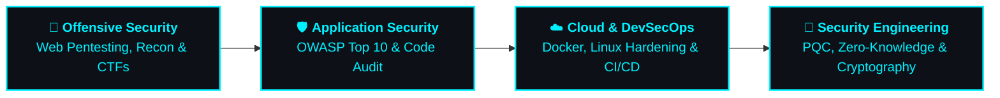

<!-- Hero Banner & Typing Animation -->

 

<!-- Status Badges -->

 

<!-- Social & Contact Badges -->

---

> [!TIP]
> **Core Philosophy:** *"Learn. Break. Build. Secure."* — I believe the most resilient defensive systems are built by engineers who understand how systems break from an offensive perspective.

---

### 🧑‍💻 Executive Bio

I am a **BS Cybersecurity graduate** dedicated to bridging the gap between offensive vulnerability discovery and defensive cryptographic engineering. My work focuses on real-world security tooling, binary/protocol reverse engineering, and architecting privacy-first systems:

* 🎓 **BS in Cybersecurity** with strong foundations in application security, network defense, and cryptography.
* 🛡️ **Offensive & Web Security Practitioner:** Hands-on experience with **OWASP Top 10**, asset enumeration, auth bypasses, and manual vulnerability verification.
* 🔬 **Cryptographic Tool Builder:** Designed and implemented **NGCloud** as my Final Year Project, pairing NIST post-quantum key encapsulation with client-side zero-knowledge architecture.
* 🔎 **Reverse Engineering:** Experienced decompiling Android APKs (**JADX**, **APKTool**), reconstructing proprietary protocols, and discovering undocumented API endpoints.
* 🐧 **System Proficiency:** Daily Linux & Kali Linux workflow, Docker container management, and Python/Bash automation.
* 🧪 **Hands-On Lab Enthusiast:** Regular practice across **Hack The Box**, **TryHackMe**, and vulnerable web labs (DVWA, OWASP Juice Shop).

---

### 🛡️ Security Focus Matrix

<table width="100%">
  <tr>
    <td width="50%" valign="top">
      

        
      

       
      <ul>
        <li><b>Web Penetration Testing:</b> Methodical enumeration, parameter fuzzing, and manual exploit verification.</li>
        <li><b>OWASP Top 10 Mitigation:</b> Identifying and mitigating XSS, SQLi, IDOR, SSRF, and CSRF vulnerabilities.</li>
        <li><b>Auth & Session Flaws:</b> JWT signature bypasses, token expiration risks, and broken access controls.</li>
        <li><b>Security Tooling:</b> Custom multithreaded port scanners and automated reconnaissance scripts.</li>
      </ul>
    </td>
    <td width="50%" valign="top">
      

        
      

       
      <ul>
        <li><b>Post-Quantum Cryptography:</b> NIST FIPS 203 <b>ML-KEM-768</b> key encapsulation mechanism.</li>
        <li><b>Client-Side Zero-Knowledge:</b> Memory-only browser cryptographic boundaries with zero server-side trust.</li>
        <li><b>Lightweight AEAD & Ciphers:</b> <b>Ascon-128a</b> authenticated encryption and custom lattice stream ciphers.</li>
        <li><b>Key Derivation & Hashing:</b> <b>Argon2id</b> memory-hard KDF and quantum-walk simulated hash (KT-QHF).</li>
      </ul>
    </td>
  </tr>
  <tr>
    <td width="50%" valign="top">
      

        
      

       
      <ul>
        <li><b>Android APK Decompilation:</b> Static bytecode inspection using <b>JADX-GUI</b> and <b>APKTool</b>.</li>
        <li><b>Protocol & API Extraction:</b> Intercepting socket payloads, extracting hidden REST endpoints, and analyzing data flow.</li>
        <li><b>Binary Fundamentals:</b> Inspecting ELF/PE structures, string extraction, and Ghidra disassembly.</li>
        <li><b>Software Reconstruction:</b> Re-engineering functional software clients from reverse-engineered specifications.</li>
      </ul>
    </td>
    <td width="50%" valign="top">
      

        
      

       
      <ul>
        <li><b>Linux Server Hardening:</b> Service auditing, SSH key policy enforcement, and permission least-privilege.</li>
        <li><b>Container Isolation:</b> Docker Compose and multi-container security configurations.</li>
        <li><b>Object Storage Security:</b> MinIO S3 bucket access policies, presigned URLs, and CORS hardening.</li>
        <li><b>Relational DB Integrity:</b> PostgreSQL schema constraints, RBAC, and hash-chained audit trails.</li>
      </ul>
    </td>
  </tr>
</table>

---

### 🚀 Flagship & Practical Projects

<table>
  <!-- NG-CLOUD Card -->
  <tr>
    <td>
      <table width="100%">
        <tr>
          <td>
            <h3>🛡️ <a href="https://github.com/Usman-Cys/NG-CLOUD">NG-CLOUD — Post-Quantum Zero-Knowledge Cloud Storage</a></h3>
            
<b>Flagship Final Year Project (BS Cybersecurity)</b>

            
A client-side zero-knowledge cloud platform engineered to withstand quantum cryptanalysis ("Harvest Now, Decrypt Later" threats). Plaintext files, passwords, and private decryption keys exist exclusively in volatile browser RAM and never reach the backend server or database.

            

              
              
              
              
              
              
              
              
            

            

              
<b>🔍 Key Security Concepts & Engineering Highlights (Click to expand)</b>

               
              <ul>
                <li><b>Client-Side WASM Cryptography:</b> Pure Rust compiled to WebAssembly running <code>ML-KEM-768</code>, <code>FS-MLWE-SC-256</code> lattice stream cipher with 1MB epoch rekeying, and <code>Argon2id</code>.</li>
                <li><b>Direct S3 Presigned Transfers:</b> Chunks upload and download directly to <b>MinIO Object Storage</b> via presigned S3 URLs, completely bypassing the backend server.</li>
                <li><b>Zero-Knowledge Sharing (Key Re-Wrapping):</b> Owners decapsulate file keys in memory and re-encapsulate them directly for recipient public keys with 7 granular permission levels.</li>
                <li><b>Bandwidth-Saving Delta Sync:</b> 4 MB chunks are hashed with <code>KT-QHF</code>; identical chunks are linked across versions, saving up to 90% upload bandwidth.</li>
              </ul>
            

          </td>
        </tr>
      </table>
    </td>
  </tr>

  <!-- Reverse Engineering Card -->
  <tr>
    <td>
      <table width="100%">
        <tr>
          <td>
            <h3>🔍 <a href="https://github.com/Usman-Cys/partybox-photobooth-final">Android APK Reverse Engineering & Protocol Reconstruction</a></h3>
            
<b>Binary & Protocol Reverse Engineering Project</b>

            
In-depth static and dynamic reverse engineering of proprietary Android APKs (<a href="https://github.com/Usman-Cys/kodak-reverse-eng">Kodak</a> & <a href="https://github.com/Usman-Cys/partybox-photobooth-final">PartyBox Photobooth</a>). Successfully extracted hidden API endpoints, disassembled internal state controllers, identified communication ports, and re-engineered a modern, clean software implementation from ground up.

            

              
              
              
              
              
            

            

              
<b>🔍 Reverse Engineering Methodology (Click to expand)</b>

               
              <ul>
                <li><b>Bytecode & Smali Inspection:</b> Decompiled compiled classes using <b>JADX</b> and <b>APKTool</b>, reversing obfuscated class structures and tracing logic execution paths.</li>
                <li><b>Socket & Port Enumeration:</b> Extracted hardcoded TCP socket interfaces, wireless transmission commands, and internal REST API routes.</li>
                <li><b>Full System Re-implementation:</b> Used the extracted protocol blueprint to re-author a clean, independent modern application with full functionality.</li>
              </ul>
            

          </td>
        </tr>
      </table>
    </td>
  </tr>

  <!-- VulnIntel Card -->
  <tr>
    <td>
      <table width="100%">
        <tr>
          <td>
            <h3>⚡ <a href="https://github.com/Usman-Cys/VulnIntel">VulnIntel — Vulnerability Assessment & Security Analysis Platform</a></h3>
            
<b>Application Security & Automated Triage</b>

            
An intelligent security analysis engine uniting <b>DAST</b> and <b>SAST</b> security scan data with Google Gemini AI contextual analysis for automated attack surface mapping, CVSS 3.1 scoring, and prioritized remediation playbooks.

            

              
              
              
              
            

          </td>
        </tr>
      </table>
    </td>
  </tr>

  <!-- Security Tooling Suite Card -->
  <tr>
    <td>
      <table width="100%">
        <tr>
          <td>
            <h3>🧰 Network Reconnaissance & Security Tooling Suite</h3>
            
A collection of purpose-built security utilities developed for reconnaissance, parameter fuzzing, and cryptographic entropy analysis:

            <ul>
              <li>🔌 <b><a href="https://github.com/Usman-Cys/Port-scanner">Port-Scanner</a>:</b> Multithreaded TCP & UDP network scanner engineered for rapid socket probing, service banner identification, and firewall state detection.</li>
              <li>🔑 <b><a href="https://github.com/Usman-Cys/password-analyzer">Password-Analyzer</a>:</b> Security evaluation tool calculating Shannon entropy, testing dictionary vulnerability, and verifying cryptographic salt/hash resistance.</li>
              <li>🎯 <b><a href="https://github.com/Usman-Cys/Sentinel">Sentinel</a>:</b> Web pentest assistant automating initial reconnaissance, endpoint enumeration, and parameter discovery.</li>
            </ul>
          </td>
        </tr>
      </table>
    </td>
  </tr>
</table>

---

### 🧪 Practical Security Labs & Continuous Training

I regularly practice manual penetration testing, privilege escalation, and network analysis on competitive platforms:

| Platform / Lab | Focus Areas & Hands-On Skills | Primary Tools Used |
| :--- | :--- | :--- |
| **Hack The Box** | Linux & Windows Privilege Escalation, SSH Enumeration, Web Exploitation, CTF challenges | `Nmap`, `Burp Suite`, `LinPEAS`, `Netcat` |
| **TryHackMe** | Web Security Fundamentals, Network Security, Active Directory Basics, Linux Hardening | `Gobuster`, `Hydra`, `Metasploit`, `John` |
| **Vulnerable Apps** | Manual OWASP testing on DVWA, OWASP Juice Shop, and custom vulnerable microservices | `Burp Suite Pro`, `OWASP ZAP`, `SQLmap` |
| **Traffic Inspection** | Dissecting packet captures (.pcap), spotting cleartext credential leaks, DNS analysis | `Wireshark`, `Tcpdump`, `Tshark` |

---

### 🛠️ Technical Arsenal

#### 🔒 Offensive Security, Penetration Testing & Audit

#### 🔐 Cryptography & Standards

#### 💻 Programming & Scripting Languages

#### ⚙️ Web, Cloud & Storage Infrastructure

---

### 🚧 What I'm Building & Career Pathway

> **Current Objective:** Transitioning university achievements into professional roles in **Cybersecurity**, **Application Security (AppSec)**, **Penetration Testing**, or **Cloud Security Engineering**.

---

### 📚 Currently Exploring & Expanding

* 🎯 Deepening manual **Web Application Penetration Testing** methodologies beyond automated tooling.
* 🐧 Advanced **Linux Privilege Escalation** techniques and kernel vulnerability identification.
* ☁️ **Cloud Security Posture Management (CSPM)** & AWS / S3 container policy auditing.
* 🔬 Low-level **Binary Exploitation & Memory Safety** fundamentals in C and Rust.

---

### 📊 GitHub Activity & Metrics

  <table border="0">
    <tr>
      <td>
        
      </td>
      <td>
        
      </td>
    </tr>
  </table>
   
  

---

### 🤝 Let's Connect

I am actively open to discussing **entry-level and junior cybersecurity opportunities**, technical collaborations, and project discussions:

 

<i>Designed with focus on practical cybersecurity, cryptographic engineering, and clean architecture.</i>

